#  Project Aplikasi MyBook 

**Nama:** Afdhal Agislam

**NIM:** 312410445  

**Kelas:** TI 24 A5

**Mata Kuliah:** Pemrograman Mobile 1D

**Dosen Pengampu:** Donny Maulana, S.Kom., M.M.S.I.

###  1. MYBOOK PROJECT    

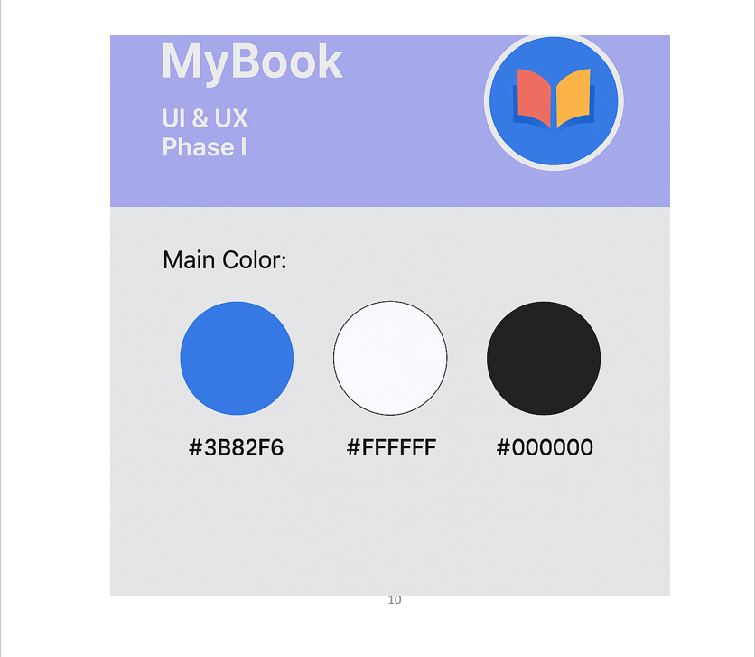

---

## 2. STORYBOARD PROJECT

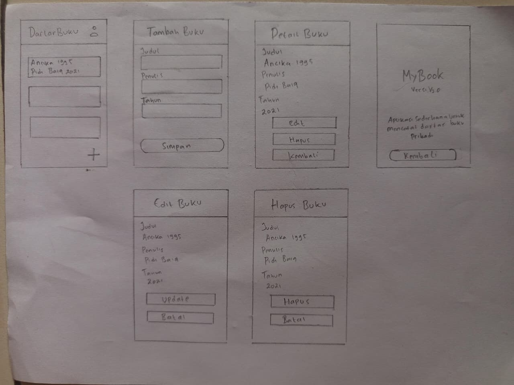

---
### Deskripsi Storyboard
Storyboard ini menggambarkan alur interaksi pengguna dalam aplikasi MyBook, sebuah aplikasi sederhana untuk mencatat daftar buku pribadi. Setiap scene menunjukkan tampilan antarmuka, fungsi tombol, serta respon aplikasi terhadap tindakan pengguna.

## 3. WIREFRAME PROJECT

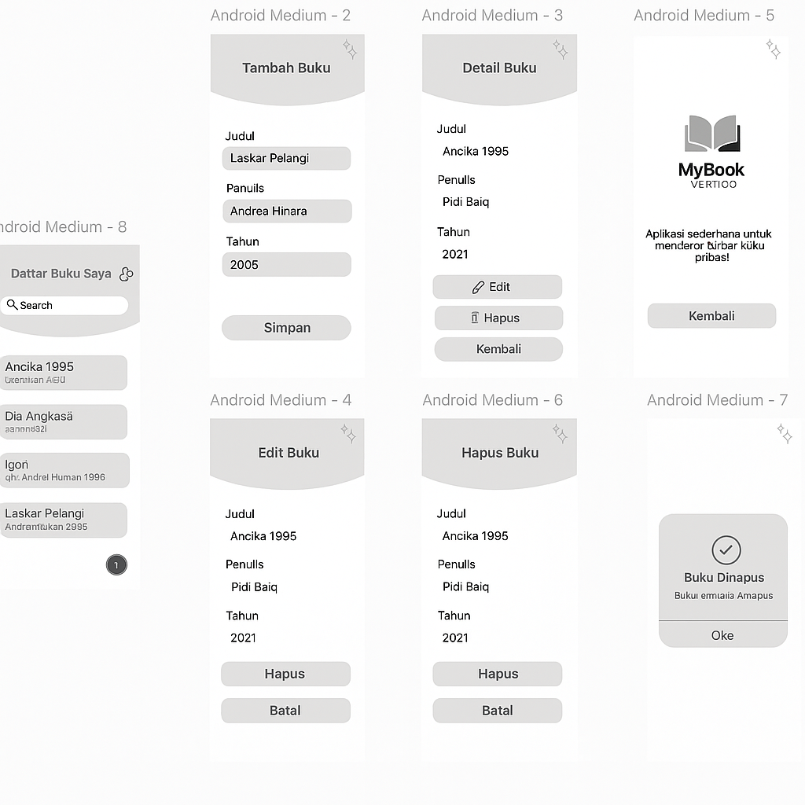

---
### Deskripsi Wireframe
Wireframe aplikasi MyBook merupakan rancangan awal yang menggambarkan struktur, tata letak, dan alur interaksi dasar dari aplikasi pencatatan buku pribadi. Setiap elemen visual dibuat sederhana tanpa warna penuh, dengan tujuan memfokuskan perhatian pada fungsi dan posisi komponen, bukan pada estetika desain akhir.

Wireframe ini membantu menggambarkan bagaimana pengguna akan melakukan pencarian, menambah, melihat detail, memperbarui, hingga menghapus data buku dengan alur yang jelas dan mudah dipahami.

## 4. MOCKUP PROJECT

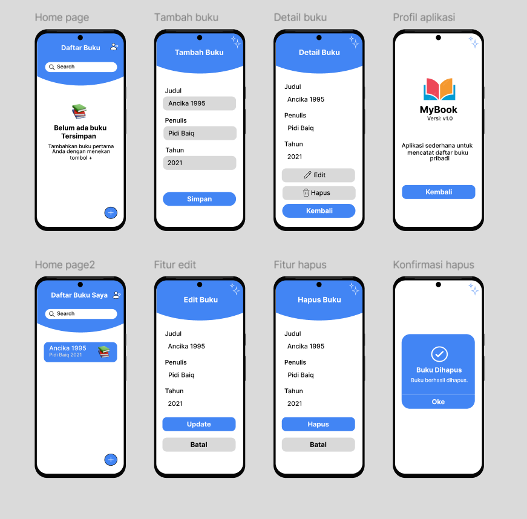

---
### Deskripsi Mockup
Mockup aplikasi MyBook merupakan representasi visual berwarna yang menunjukkan tampilan akhir (final look) dari antarmuka aplikasi. Berbeda dengan wireframe yang hanya menampilkan rangka dasar tanpa detail visual, mockup memberikan gambaran yang lebih realistis mengenai desain, warna, tipografi, ikon, serta tata letak setiap elemen pada aplikasi. Mockup ini membantu pengguna, pengembang, dan desainer memahami bagaimana aplikasi akan terlihat saat digunakan.

## 5. SPLASHSCREEN 

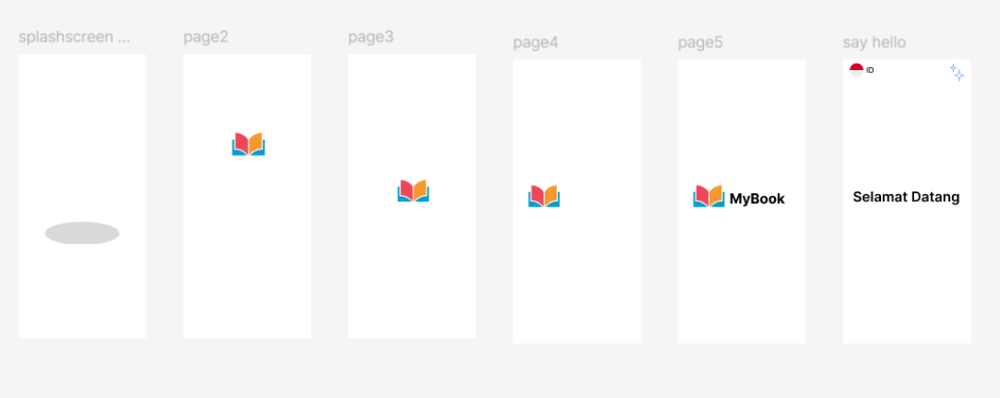

---
### Deskripsi Splashscreen
Splashscreen pada aplikasi MyBook merupakan tampilan awal yang muncul sesaat setelah pengguna membuka aplikasi. Halaman ini dirancang untuk memberikan kesan pertama yang profesional, ramah, dan mudah dikenali. Desain splashscreen memuat identitas visual aplikasi secara sederhana namun tetap elegan.

## 6. UI (USER INTERFACE) PROJECT

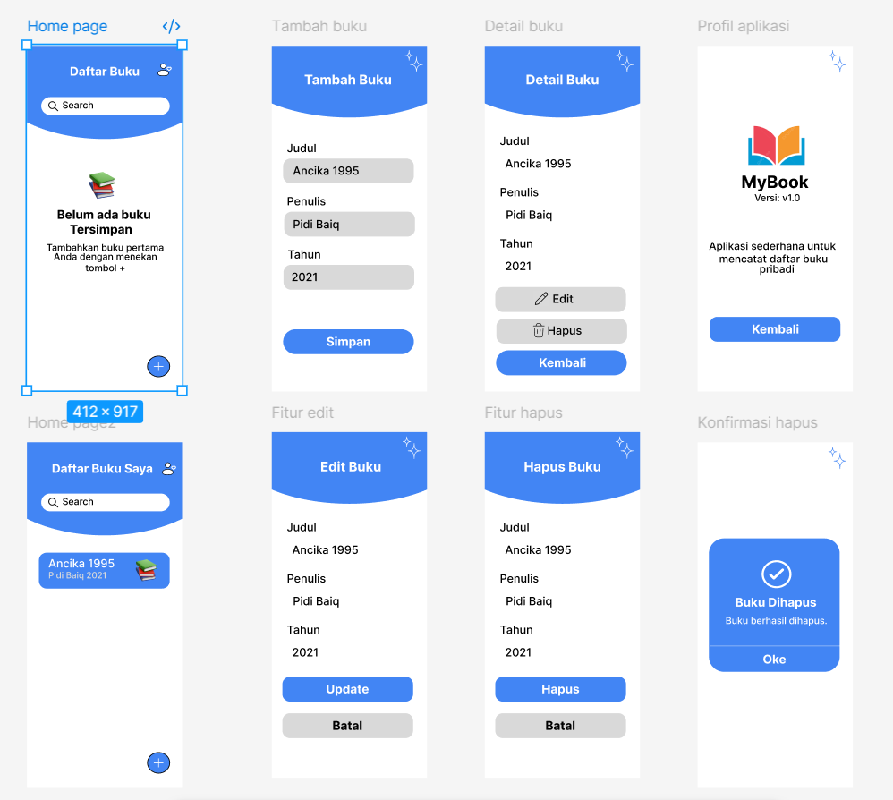

### Deskripsi UI (USER INTERFACE) Project 
Aplikasi MyBook memiliki tampilan antarmuka yang sederhana, bersih, dan mudah digunakan. Desain UI dibuat dengan fokus pada kenyamanan pengguna dalam mencatat dan mengelola daftar buku pribadi. Dominasi warna biru memberikan kesan modern, konsisten, dan profesional di seluruh halaman aplikasi.

## 7. UX (USER EXPERIENCE) PROJECT

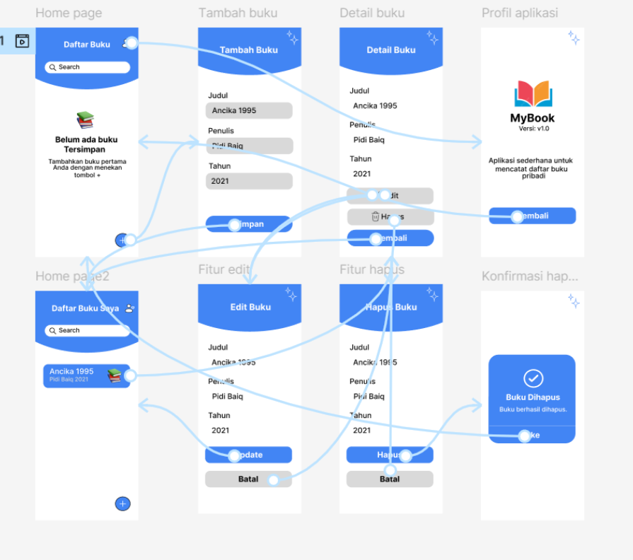

## 8. IMPLEMENTASI ANDROID STUDIO

###  Splashscreen

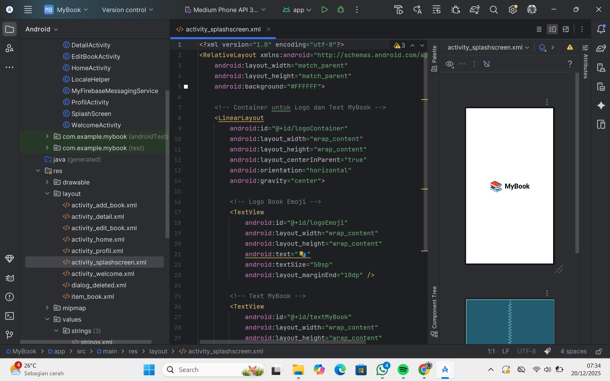

### Tampilan Welcome

### Tampilan Home/Daftar buku

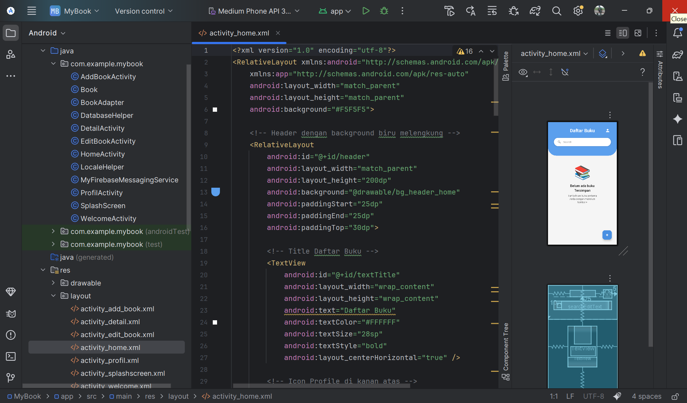

### Fitur Tambah Buku

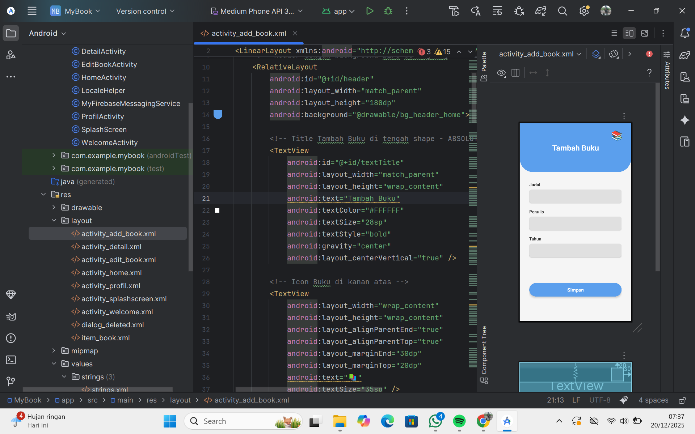

### Fitur Detail Buku

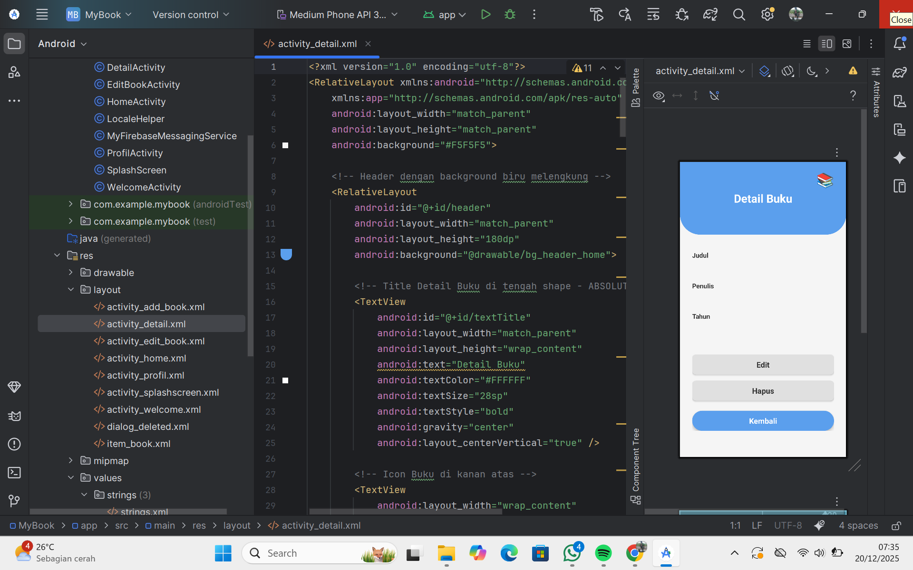

### Fitur Edit Buku

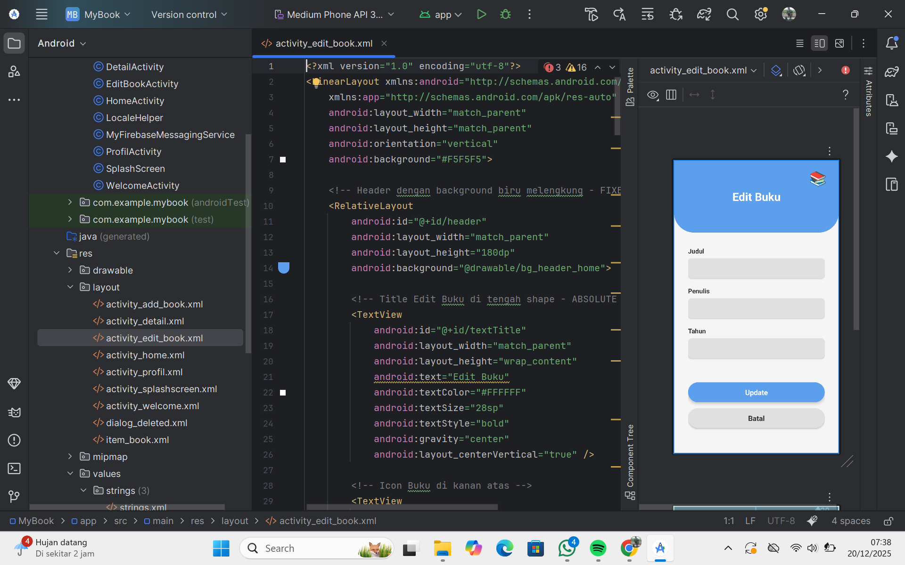

### Tampilan Profil Aplikasi My Book

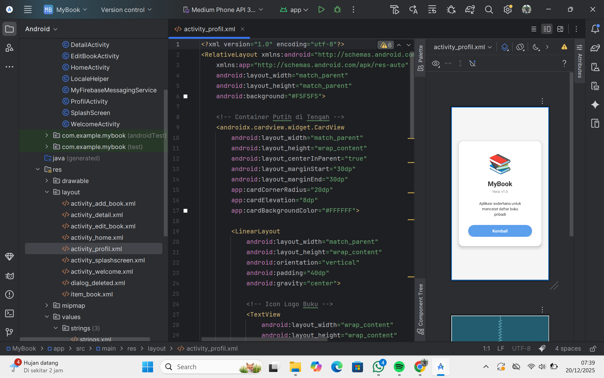

### Tampilan Deteksi Location

Lokasi di Japan

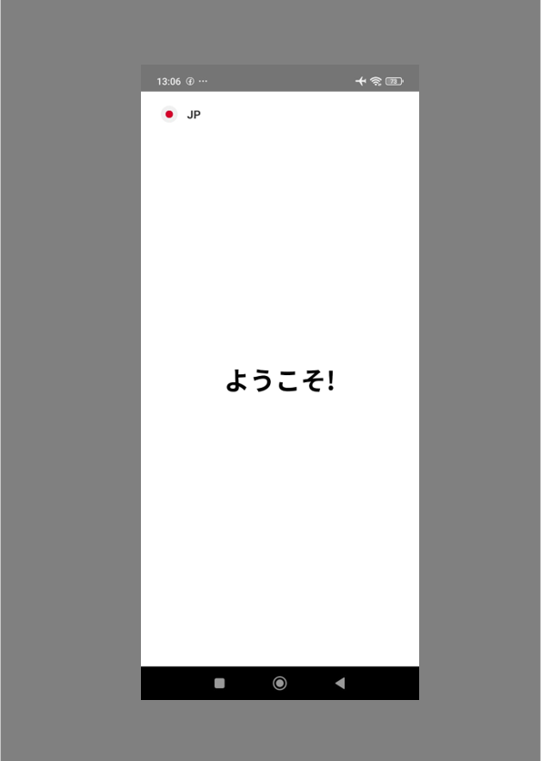

## 9. MEMBUAT NOTIFIKASI 

### Firebase

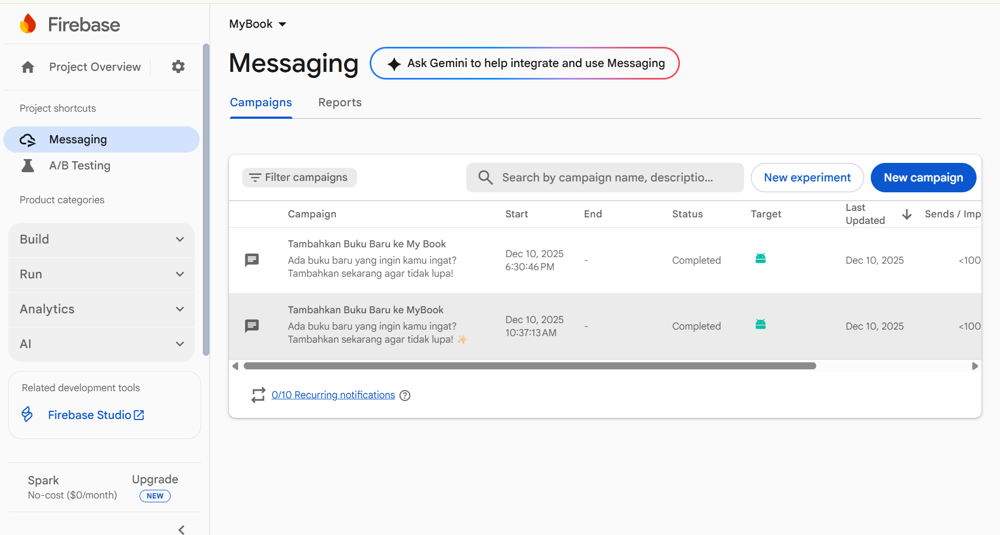

### Tampilan Notifikasi Muncul

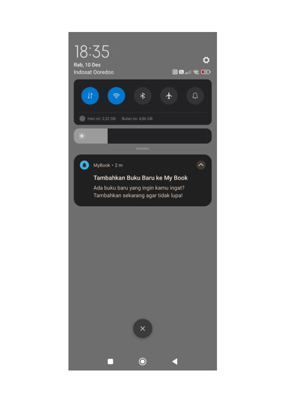

